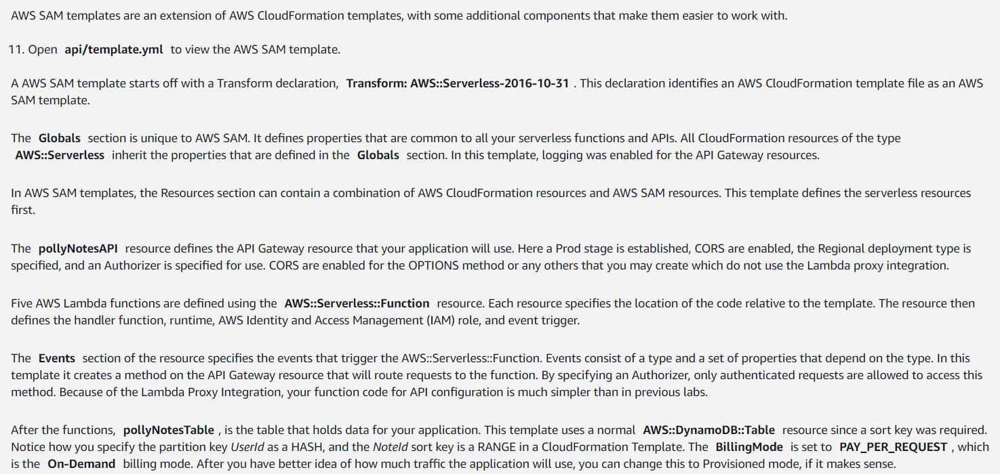
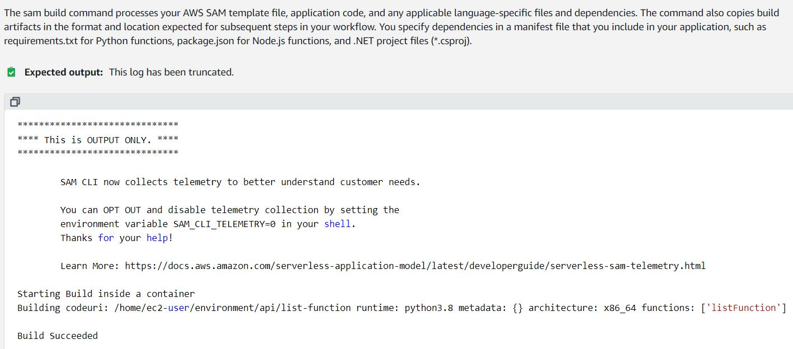

# Build and deploy with SAM templates and monitoring with X-Ray

- Enable your application pacakge to generate logs
- Understand SAM Templates and deploy application

## Configure X-Ray capabilities in the code

`echo 'aws-xray-sdk==2.4.3' >> api/delete-function/requirements.txt`

`cat api/delete-function/requirements.txt`

Modify in delete-function/app.py to add xray logger;

```python
import logging
from aws_xray_sdk.core import xray_recorder
from aws_xray_sdk.core import patch_all

logger = logging.getLogger()
logger.setLevel(logging.INFO)
patch_all()
```



in template.yml copy:

```yaml
Globals:
  Function:
    Tracing: Active
  Api:
    TracingEnabled: true
    MethodSettings:
      - LoggingLevel: INFO
        ResourcePath: '/*'
        HttpMethod: '*'
```

## Deploy the application with SAM

add more disk space

`bash resize.sh 15`

Create a bucket variable to then used in deploy command:
`apiBucket=$(aws s3api list-buckets --output text --query 'Buckets[?contains(Name, `pollynotesapi`) == `true`].Name')`

build container with SAM CLI (takes 2 min to end):

`sam build --use-container`



and now, deploy with SAM:
`sam deploy --stack-name polly-notes-api --s3-bucket $apiBucket --parameter-overrides apiBucket=$apiBucket`

and then test deploy in the browser. 