# Lab 5 - Troubleshoot Your Pipeline (3 HOURS lab)
This lab tests your understanding of ML pipelines by allowing you to troubleshoot and fix a broken environment.
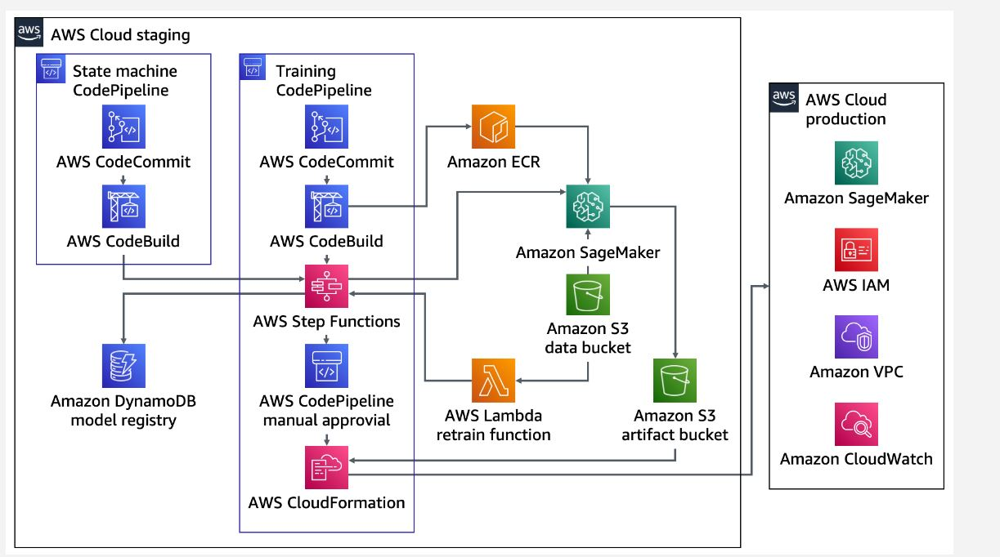

## task resolve 1
"deployModelPipeline" in the codepipeline 
In the build stage under the  buildImage choose AWS Codebuild. Choose the build that one is fail
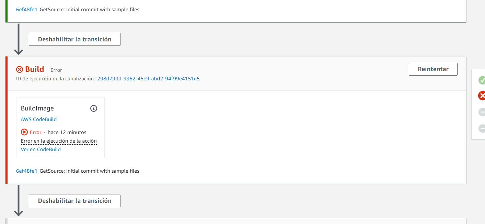
Find several errors, exist status 125 and other with exit status 1. Both docker errors. Check in cloudwatch the errors.
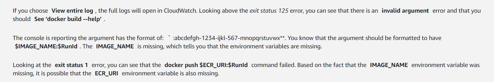

Problem resolution

In the left, codebuild choose build projects
Edit and select Environment in the service role choose 

Add varible environment ECR_URI and MOdel_image and Update them
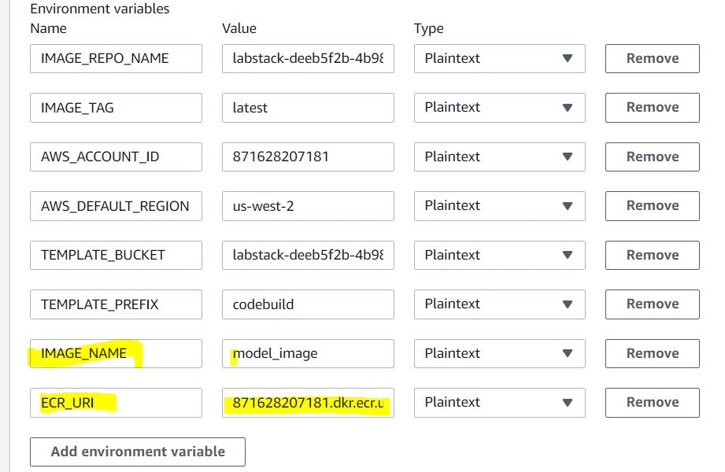
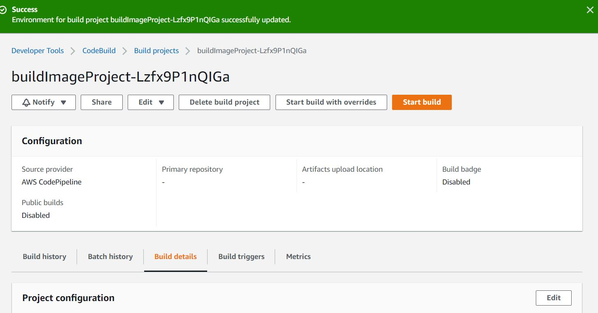


## TASK 2. Challenge

still failed in cloudwatch. 

```
[Container] 2023/02/16 09:15:50 Phase context status code: COMMAND_EXECUTION_ERROR Message: Error while executing command: docker build -t $IMAGE_NAME:$RunId .. Reason: exit status 1
```

solution, add in the configuration update environment privilegMode
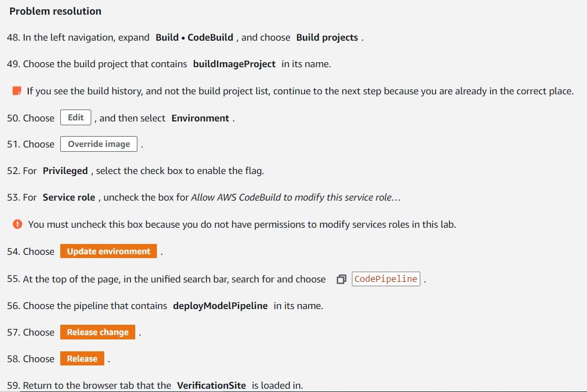

In the codepipeline, release change and check release to update. and check build its ok

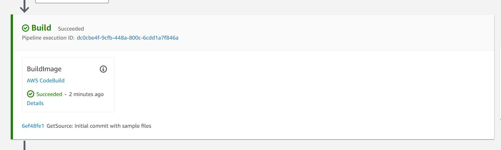

Problem... error in the training phase

# Task 3
Error because is causing the state machine  to fail before it ends. Resulting in the SageMaker endpoint in not created.

Select the state machine that contains TrainingStateMachine in its name. Choose the name of the execution that ran lastly
Execution event history card, expand the taskFailed step by choosing the right caret.

"FailureReason": "ClientError: Artifact upload failed:Error 7: AccessDenied (403): Access Denied"

because the sagemakeRole does not have permision to write the model artifact in the s3 bucket

Problem solution:
In IAM and sagemaker role in its name.

Edit th policy with the next json

```
{
    "Statement": [
        {
            "Action": [
                "cloudwatch:PutMetricData",
                "codepipeline:PutJobFailureResult",
                "codepipeline:PutJobSuccessResult",
                "events:DescribeRule",
                "events:PutRule",
                "events:PutTargets",
                "iam:PassRole",
                "kms:Decrypt",
                "kms:Encrypt",
                "kms:GenerateDataKey",
                "kms:ReEncryptTo",
                "kms:ReEncryptFrom",
                "logs:CreateLogGroup",
                "logs:CreateLogStream",
                "logs:DeleteLogGroup",
                "logs:DeleteLogStream",
                "logs:PutLogEvents",
                "s3:PutObject",
                "sagemaker:CreateEndpoint",
                "sagemaker:CreateModel",
                "sagemaker:CreateTrainingJob",
                "sagemaker:DeleteEndpoint",
                "sagemaker:DeleteEndpointConfig",
                "sagemaker:DeleteModel",
                "sagemaker:UpdateEndpoint",
                "states:UpdateStateMachine"
            ],
            "Resource": "*",
            "Effect": "Allow"
        },
        {
            "Condition": {
                "ForAllValues:StringLike": {
                    "sagemaker:InstanceTypes": [
                        "ml.t2.large",
                        "ml.t2.medium",
                        "ml.m5.large",
                        "ml.m4.large"
                    ]
                }
            },
            "Action": [
                "sagemaker:CreateEndpointConfig"
            ],
            "Resource": [
                "arn:aws:sagemaker:*:*:endpoint-config/*"
            ],
            "Effect": "Allow"
        }
    ]
}
```

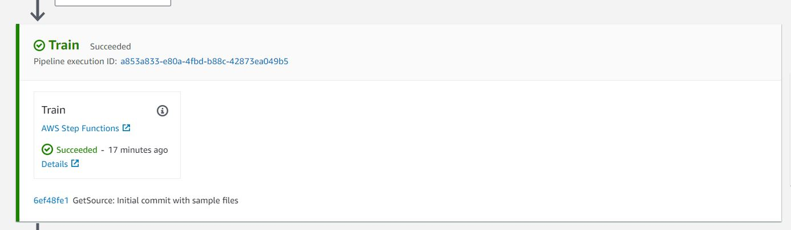

Next step is waiting for a manual review!
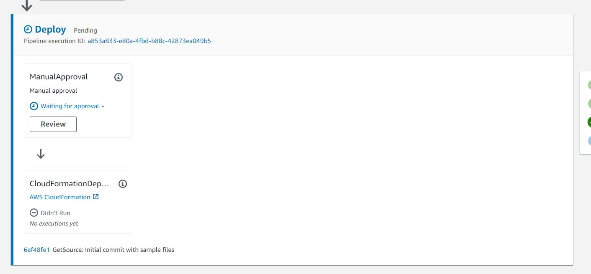

Pipeline execution
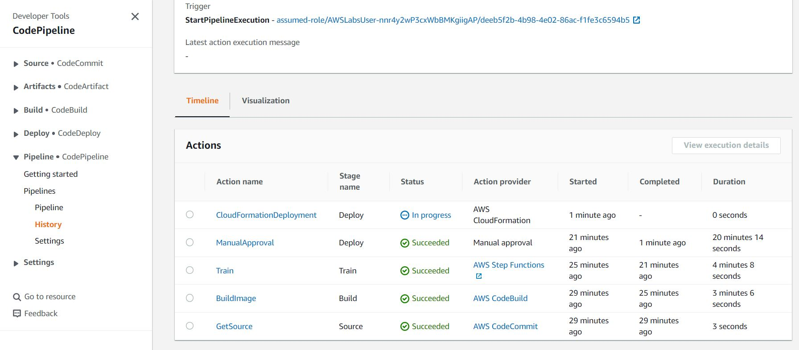


## Taks 4. Challenge
In this task we review the retrain Models with several datasets stored in s3 (uploaded) and the training machine pipeline runs automatically started.

Download the dataset and unzip. In S3, in modeldataset bucket upload the data (Upload Folder option)
Now lets check the properties in the s3 bucket. In event notification section create a Create a Event Notification.
And create a action with a lambda funtion. triggerRetraining

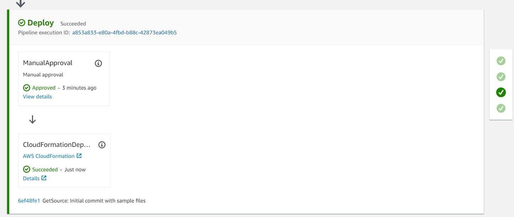

# Task 5. 
When the pipeline runs ok check in dynamodB the artifact is not stored correctly.
Explore items and review 

Solution. 

In codeCommit service choose the repository with contains stateMachineCode in its name.
and select state_machine_manager.py in the workflow definition chain to include: register_artifact_step after the model step.

```
# Chain the steps together to generate a full Amazon Step Functions
workflow_definition = steps.Chain([
    training_step,
    model_step,
    register_artifact_step,
    endpoint_config_step,
    endpoint_step,
    endpoint_wait_step,
    model_test_step
])
```

And release again.
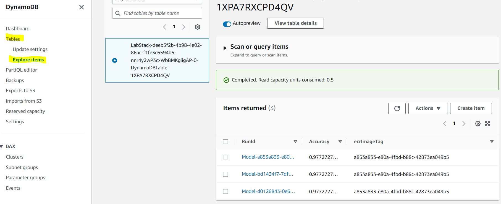

