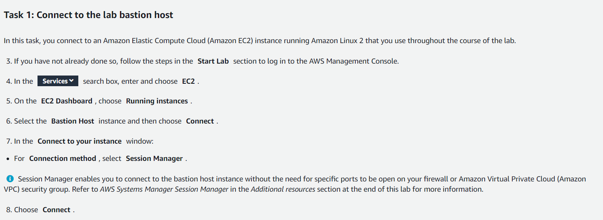
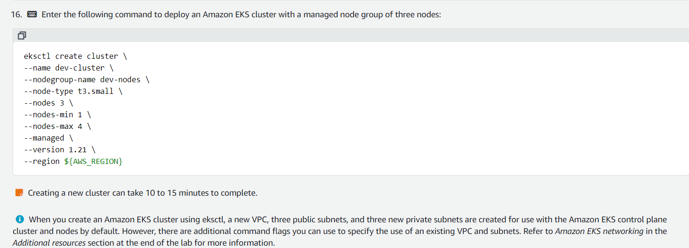
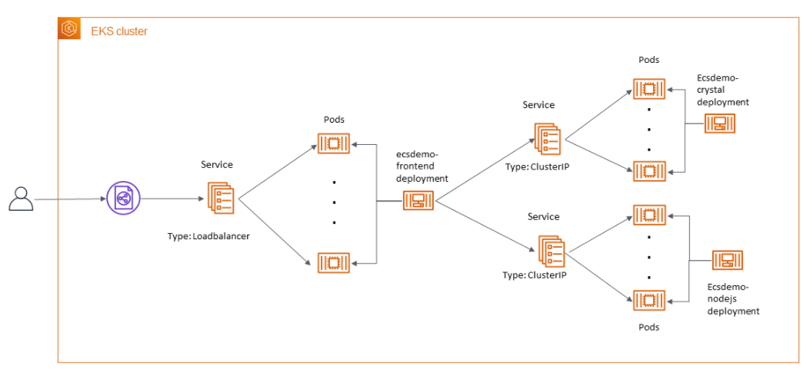
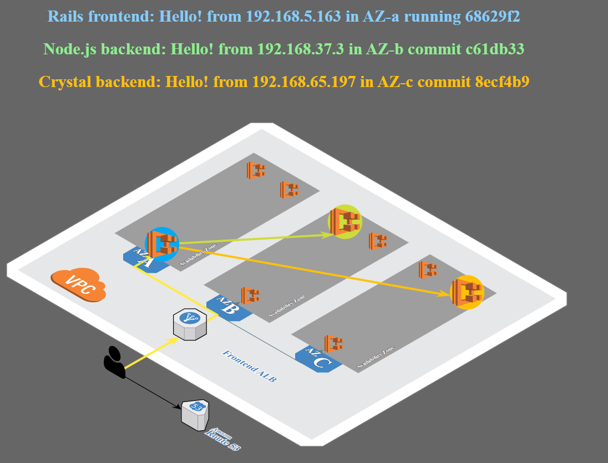

#Lab 1 EKS



## Deploy a EKS Clsuter
Download kubernetes eksctl  utility:

`sudo curl --location -o /usr/local/bin/kubectl https://amazon-eks.s3.us-west-2.amazonaws.com/1.21.2/2021-07-05/bin/linux/amd64/kubectl`

Make eksctl an executable file:

`sudo chmod +x /usr/local/bin/kubectl`

Download and unzip:
`curl --location "https://github.com/weaveworks/eksctl/releases/latest/download/eksctl_$(uname -s)_amd64.tar.gz" | tar xz -C /tmp`

Move eksctl to /usr/local/bin directory:
`sudo mv -v /tmp/eksctl /usr/local/bin`

`export AWS_REGION=$(curl --silent http://169.254.169.254/latest/meta-data/placement/region) && echo $AWS_REGION`



```console
eksctl create cluster \
--name dev-cluster \
--nodegroup-name dev-nodes \
--node-type t3.small \
--nodes 3 \
--nodes-min 1 \
--nodes-max 4 \
--managed \
--version 1.21 \
--region us-west-2
```



## Task 3. Deploy configuration sample
`kubectl get nodes`

`aws s3 cp s3://aws-tc-largeobjects/ILT-TF-200-COREKS-10-EN/lab-1/ecsdemo-crystal/ ~/ecsdemo-crystal/ --recursive`
`aws s3 cp s3://aws-tc-largeobjects/ILT-TF-200-COREKS-10-EN/lab-1/ecsdemo-frontend/ ~/ecsdemo-frontend/ --recursive`
`aws s3 cp s3://aws-tc-largeobjects/ILT-TF-200-COREKS-10-EN/lab-1/ecsdemo-nodejs/ ~/ecsdemo-nodejs/ --recursive`

`cd ~/ecsdemo-nodejs`

kubernetes deployment resource from yaml file
`kubectl apply -f kubernetes/deployment.yaml`

kubernetes service resource from yaml file
`kubectl apply -f kubernetes/service.yaml`

`kubectl get deployment ecsdemo-nodejs`


deploy crystal backend api
`cd ~/ecsdemo-crystal`

`kubectl apply -f kubernetes/deployment.yaml`

`kubectl apply -f kubernetes/service.yaml`

`kubectl get deployment ecsdemo-crystal`

frontend
`cd ~/ecsdemo-frontend`

`kubectl apply -f kubernetes/deployment.yaml`

`kubectl apply -f kubernetes/service.yaml`

`kubectl get deployment ecsdemo-frontend`

List the kubernetes deployments

`kubectl get deployments`

Obtain ip adrees of the elb 
`kubectl get service ecsdemo-frontend -o wide`

copy in a browser with http://



## Task 4. explore the POD and install an application

View the pods:
`kubectl get pods -n default`

Save the name fo the first pod
`export MY_POD_NAME=$(kubectl get pods -n default -o jsonpath='{.items[0].metadata.name}')`

View details of the POD:
`kubectl -n default describe pod $MY_POD_NAME`

Connect to the bash shell in the pod:
`kubectl exec -it ${MY_POD_NAME} -n default -- /bin/bash`

Install a game in the bash shell of the pod
`apk add micro-tetris`

## Task 5. scale out the application deployment

scale out in the hot session with 3 nodes each:

`kubectl scale deployment ecsdemo-nodejs --replicas=3`

`kubectl scale deployment ecsdemo-crystal --replicas=3`

list all the deployments
`kubectl get deployments`
