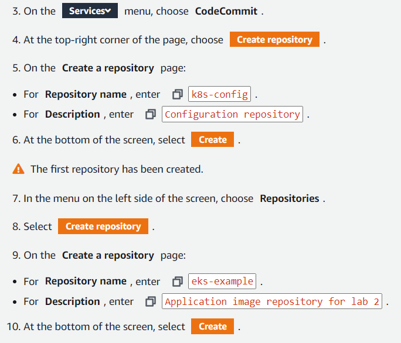
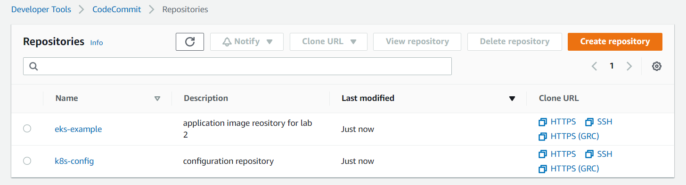
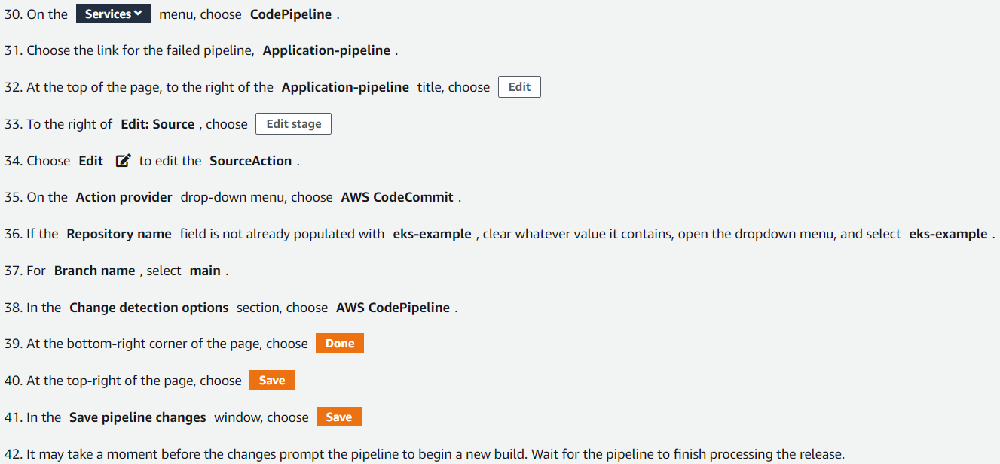

# Lab 2: Continuous deployment with GitOps


## Task 1: Create codeCommit repositories
Create 2 codeCommit repositories. One used for basic application docket start build other to store manifest file



## Task 2: Connect bastion host and create ssh keys for aws codeCommit

In EC2 and connect in running to bastion with Session Manager. In the session manager console:

`mkdir ~/.ssh && cd ~/.ssh`
ssh-keygen -t rsa

leave all with enter and give permisions:

`chmod 600 ~/.ssh/id_rsa`

attach public key to the git user:

`aws iam upload-ssh-public-key \`
`--user-name gitUser \`
`--ssh-public-key-body file://~/.ssh/id_rsa.pub`


and review the password with: 

`KEYID=$(aws iam list-ssh-public-keys --user-name gitUser | jq -r '.[] | .[] | .SSHPublicKeyId') && echo $KEYID`

create a ssh config file associated to the public and private keys.

```console
cat <<EOF > ~/.ssh/config
Host git-codecommit.*.amazonaws.com
  User ${KEYID}
  IdentityFile ~/.ssh/id_rsa
EOF
chmod 700 ~/.ssh/config
```

`ssh git-codecommit.us-west-2.amazonaws.com`



## Task 3. Create a docker image using codePipeline

User and email:

```console
git config --global user.email "victor.m.pelaez@outlook.com"
git config --global user.name "vic"
git config --global init.defaultBranch main
```

cd ~ && git clone ssh://$KEYID@git-codecommit.us-west-2.amazonaws.com/v1/repos/eks-example

Eks directory:
`cd eks-example`

copy a set of pre-created files for the sample application:
`cp -R /lab/task3/website-example/* ./`

```console
git add .
git commit -am "Initial commit"
git push
```



An in Elastic Container registry check eks-example

## Task 4: Define kubernetes infra

return to bastion host session and write;

`cd ~ && git clone ssh://$KEYID@git-codecommit.us-west-2.amazonaws.com/v1/repos/k8s-config`
`cd k8s-config`
`mkdir namespaces workloads`

view repository details:
`aws ecr describe-repositories | jq '.repositories[] | select( .repositoryName == "eks-example")'`

save variable repouri
REPO_URI=$(aws ecr describe-repositories | jq -r '.repositories[] | select( .repositoryName == "eks-example") | .repositoryUri')

Create a kubernetes manifest file with define eks-example namespace:

```console
cat << EOF > namespaces/eks-example.yaml
apiVersion: v1
kind: Namespace
metadata:
  labels:
    name: eks-example
  name: eks-example
EOF
```

Creat a manifest file definig the eks-example deployment in k8s-config directory
```console
cat << EOF > workloads/eks-example-deployment.yaml
apiVersion: apps/v1
kind: Deployment
metadata:
  name: eks-example
  namespace: eks-example
  labels:
    app: eks-example
  annotations:
    flux.weave.works/automated: "true"
spec:
  replicas: 1
  selector:
    matchLabels:
      app: eks-example
  template:
    metadata:
      labels:
        app: eks-example
    spec:
      containers:
      - name: eks-example
        image: $REPO_URI
        imagePullPolicy: IfNotPresent
        ports:
        - containerPort: 80
          name: http
          protocol: TCP
        livenessProbe:
          httpGet:
            path: /
            port: http
        readinessProbe:
          httpGet:
            path: /
            port: http
EOF
```

file that deploys a load balancer to handle traffic in eks-example containers:

```console
cat << EOF > workloads/eks-example-svc.yaml
apiVersion: v1
kind: Service
metadata:
  name: eks-example
  namespace: eks-example
  labels:
    app: eks-example
spec:
  type: LoadBalancer
  ports:
    - port: 80
      targetPort: http
      protocol: TCP
      name: http
  selector:
    app: eks-example
EOF
```

and push to the repo:

```console
git add .
git commit -am "eks-example-deployment"
git push
```

## Task 5: Install Weave Flux

use flux bootstrap git command to conect with k8s.config:

In the bastion host session to view all the namespaces, deployments, pods...

`kubectl get namespaces,services,deployments,pods --all-namespaces`

install flux CLI and review config:

`curl -s https://fluxcd.io/install.sh | sudo bash`

`flux check --pre`

Deploy flux into the cluster and use k8s-config repositry to boostrap deployment of your app:

```console
cd ~/k8s-config
flux bootstrap git \
--url=ssh://${KEYID}@git-codecommit.us-west-2.amazonaws.com/v1/repos/k8s-config \
--private-key-file=/home/ssm-user/.ssh/id_rsa \
--branch=main \
--interval=1m0s
```

repo:

`git pull`
`ls flux-system`

view namaspaces:

`kubectl get namespaces`
`kubectl get deployments,pods --all-namespaces`

`kubectl describe service eks-example -n eks-example`

## Task 6. Simulate error in the kubernetes cluster

`cd ~/k8s-config`
git branch -u origin/main main

`sed -i 's/10m0s/30s/g' ~/k8s-config/flux-system/gotk-sync.yaml`

`git add .`
`git commit -m "update gotk-sync"`
`git push`


`kubectl get events --sort-by=.metadata.creationTimestamp -n flux-system --watch`

`kubectl delete deployment eks-example -n eks-example && kubectl get events -n eks-example --watch`

`kubectl describe service eks-example -n eks-example`

