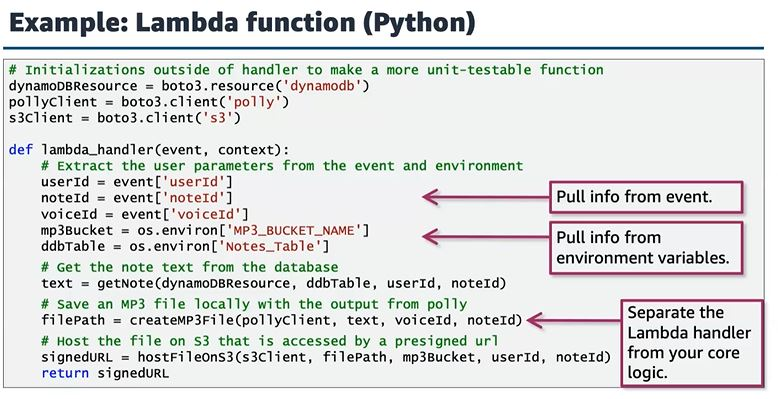

# Lambda functions!

## code example

## Create a lambda function
called `dictate-function` with python 3.9 and an existed

## Add processing logic
Three modules in dictate-function/app.py

1. Retrieve the text note from dynamodb table
2. Convert text to speech with Polly
3. Update the file to s3 with the mp3 audio

`apiBucket=$(aws s3api list-buckets --output text --query 'Buckets[?contains(Name, `apibucket`) == `true`] | [0].Name')`

`notesTable='Notes'`

`aws lambda update-function-configuration \`
`--function-name dictate-function \`
`--environment Variables="{MP3_BUCKET_NAME=$apiBucket, TABLE_NAME=$notesTable}"`

## Update function in Lambda 

`cd ~/environment/api/dictate-function` 

`zip dictate-function.zip app.py`

`aws lambda update-function-code \`
`--function-name dictate-function \`
`--zip-file fileb://dictate-function.zip`

`aws lambda update-function-configuration \`
`--function-name dictate-function \`
`--handler app.lambda_handler`

## Test with Cloud9 
File event.json contains the test

`cd ~/environment/api/dictate-function`

Invoke the function with event.json file
`aws lambda invoke \`
`--function-name dictate-function \`
`--payload fileb://event.json response.txt`

