# AWS API Gateway
Concepto de recurso y dentro de metodos (get, post...)
- RESOURCES
- STAGES & stages variables: ex. DEV or PROD 
- METHODS: ex. GET, PUT, etc

# Create API Gateway in AWS Console
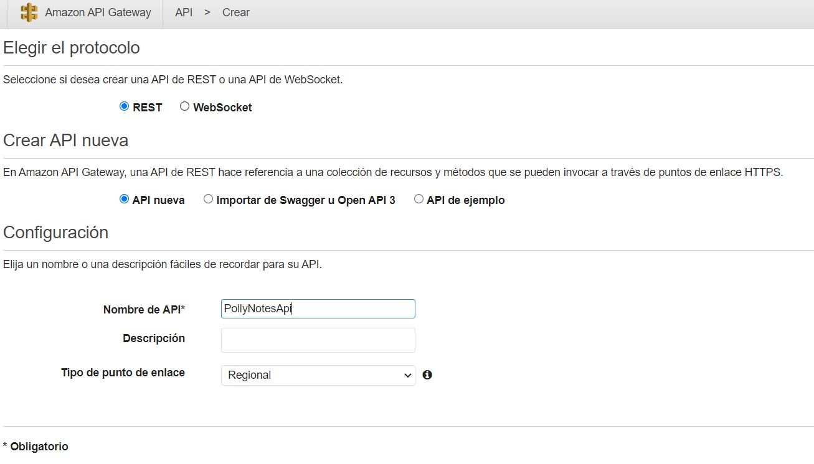

# Create resource called /notes
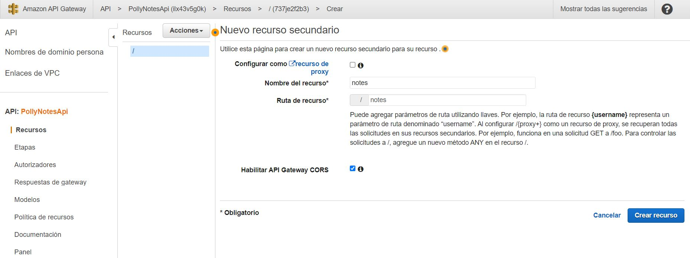

# Create GET method and mapping
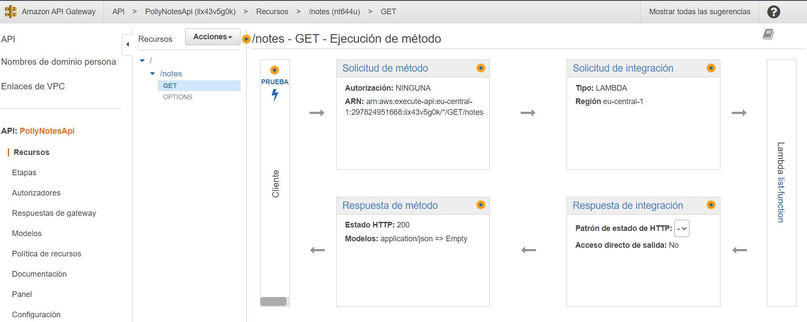

Method execution with:

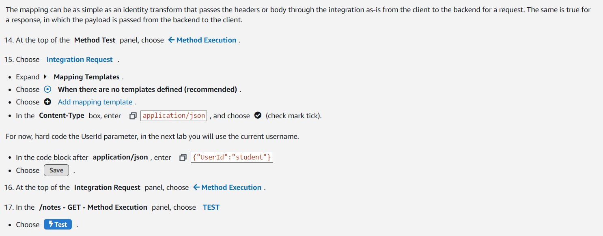

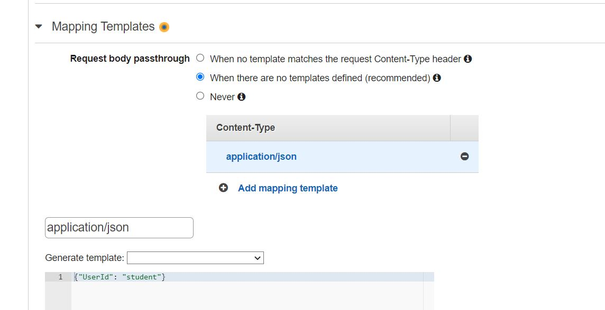


# Update the GET Method

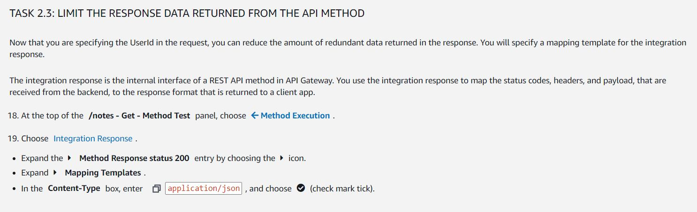

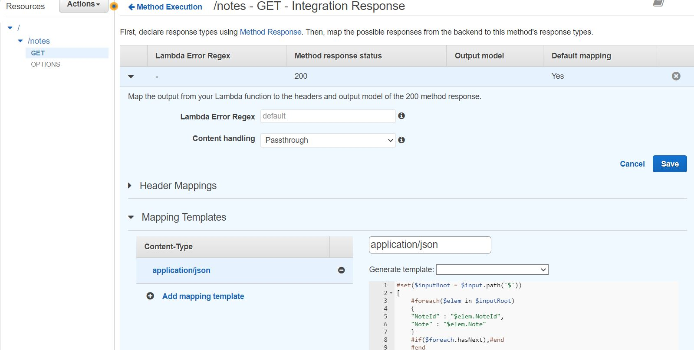

with:

```json
#set($inputRoot = $input.path('$'))
[
    #foreach($elem in $inputRoot)
    {
    "NoteId" : "$elem.NoteId",
    "Note" : "$elem.Note"
    } 
    #if($foreach.hasNext),#end
    #end
]
```

## Create POST method
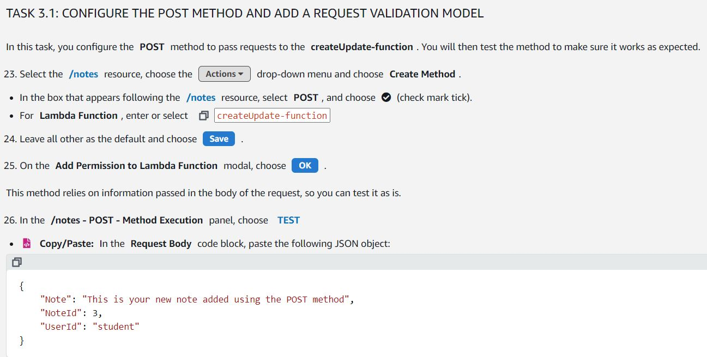

# Enforce Schema
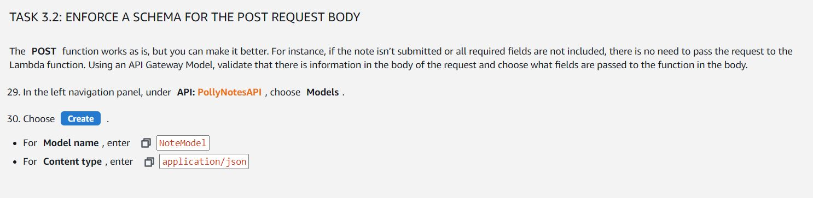

with:

```json
{
    "title": "Note",
    "type": "object",
    "properties": {
        "UserId": {"type": "string"},
        "NoteId": {"type": "integer"},
        "Note": {"type": "string"}
    },
    "required": ["UserId", "NoteId", "Note"]
}
```


## Test POST method
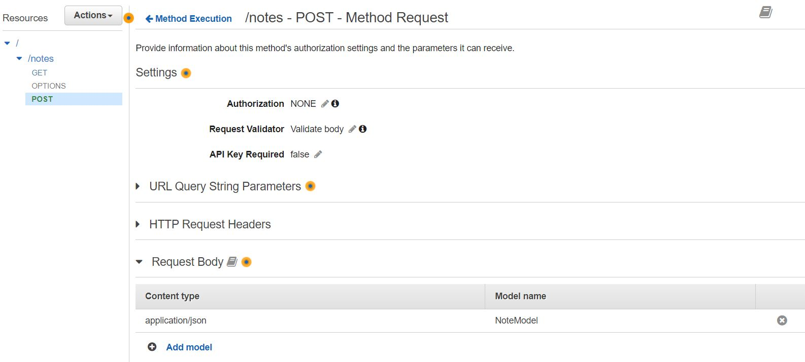


## test request validator

in test, method execution:
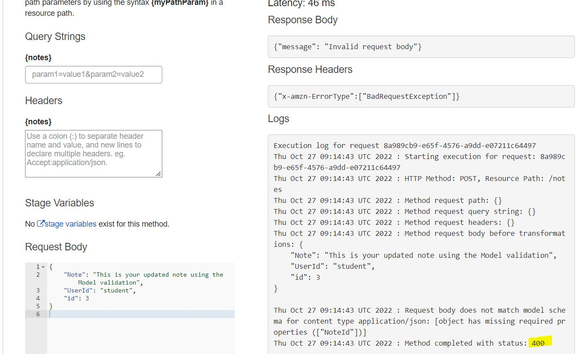

## Deploy the API with CORS configuration
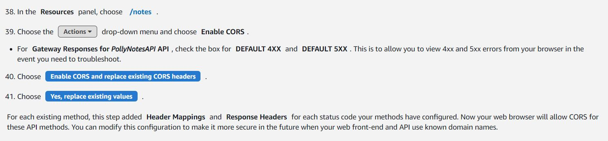

## Deploy the API
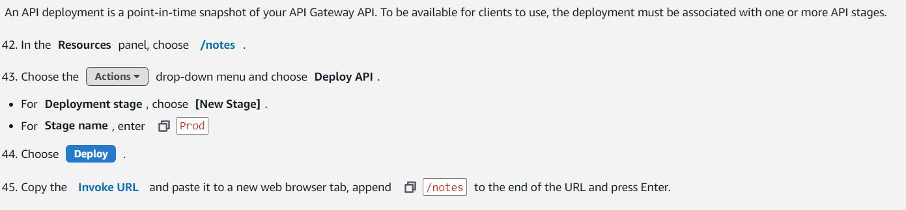